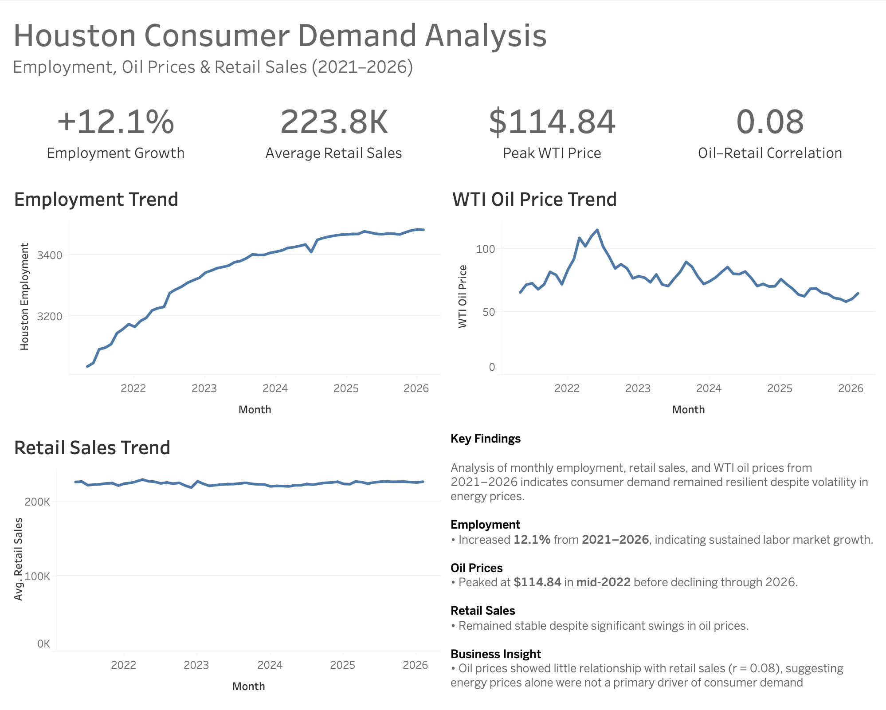

# Houston Consumer Demand Analysis

## Executive Summary

This project analyzes the relationship between Houston employment, WTI crude oil prices, and U.S. retail sales between 2021 and 2026.

Using Python, SQL, and Tableau, I built an end-to-end analytics workflow that integrates multiple public economic datasets into a unified analytical dataset for exploratory business analysis and executive reporting. The project evaluates how employment, oil prices, and consumer demand moved together between 2021 and 2026.

The workflow includes data acquisition, transformation, validation, SQL-based analysis, and dashboard development.

---

## Business Question

Houston is one of the largest energy hubs in the United States, making it a useful market for evaluating the relationship between energy prices, labor markets, and consumer demand.

The objective of this project was to determine whether fluctuations in oil prices corresponded with changes in employment and consumer demand. By integrating employment, energy, and retail sales data into a unified analytical dataset, the analysis examines how these indicators evolved between 2021 and 2026.

---

## Key Findings

### 1. Houston employment increased approximately 12.1% between 2021 and 2026, indicating sustained labor market growth.

Houston employment grew from approximately 3.0 million workers in 2021 to approximately 3.5 million workers in 2026 despite periods of economic volatility.

### 2. Oil prices experienced significant volatility, peaking in 2022.

WTI crude oil prices exceeded $110 per barrel during 2022 before gradually declining through 2025 and 2026.

### 3. Consumer demand remained relatively stable despite oil-price fluctuations.

Retail sales showed modest variation compared to the volatility observed in oil prices, suggesting resilient consumer spending throughout the analysis period.

### 4. Oil prices were not a strong predictor of retail demand.

Correlation analysis identified only a weak relationship between oil prices and retail sales, indicating that energy prices alone did not meaningfully explain changes in consumer demand.

---

## Project Architecture

```
FRED Employment Data
        │
EIA WTI Oil Price Data
        │
FRED Retail Sales Data
        ▼
Python (Pandas) ETL
        ▼
Data Cleaning & Validation
        ▼
Monthly Aggregation & Standardization
        ▼
Unified Analytical Dataset
        ▼
SQLite Database
        ▼
SQL Analysis Layer
        ▼
Tableau Dashboard
```

---

## Technology Stack

* Python (Pandas)

* SQL

* SQLite

* Tableau

* VS Code

* Git / GitHub

---

## Data Sources

### Houston Employment

* Source: FRED
* Monthly employment data for the Houston metropolitan area

### WTI Crude Oil Prices

* Source: U.S. Energy Information Administration (EIA)
* Daily oil prices aggregated into monthly averages

### U.S. Retail Sales

* Source: FRED
* Monthly retail sales data used as a proxy for consumer demand

---

## Data Engineering Workflow

1. Retrieved Houston employment, WTI crude oil price, and U.S. retail sales data from public economic data sources.
2. Used Python (Pandas) to clean, validate, and standardize each dataset.
3. Standardized date fields and aligned all datasets to a common monthly grain.
4. Aggregated daily oil prices into monthly averages.
5. Established a consistent analytical schema across all sources.
6. Merged the datasets into a unified analytical dataset.
7. Performed data validation checks.
8. Loaded the final dataset into SQLite.
9. Used SQL for KPI reporting, trend analysis, and relationship analysis.
10. Connected the analytical dataset to Tableau for reporting and visualization.

---

## SQL Analysis

SQL was used to generate KPI summaries, evaluate trends, compare yearly performance, and investigate relationships between employment, oil prices, and retail sales.

Representative query used to summarize annual employment, oil prices, and retail sales trends:

### Example SQL Query

```
SELECT
    SUBSTR(month, 1, 4) AS year,
    AVG(houston_employment) AS avg_employment,
    AVG(avg_wti_oil_price) AS avg_oil_price,
    AVG(retail_sales) AS avg_retail_sales
FROM houston_consumer_demand
GROUP BY year
ORDER BY year;
```

---

## Dashboard



The dashboard summarizes the primary business metrics and trends identified during the analysis, allowing stakeholders to quickly evaluate employment growth, oil-price volatility, retail sales performance, and the relationship between macroeconomic indicators.

---

## Challenges & Decisions

### Different Levels of Granularity

Employment and retail sales data were monthly, while oil prices were daily. Daily oil prices were aggregated into monthly averages to create a consistent analytical grain.

### Schema Standardization

Each source used different naming conventions and date formats. Python was used to standardize schemas prior to integration.

### Analytical Dataset Design

A monthly grain was selected to maximize comparability across datasets while preserving trend-level analysis.

---

## Future Improvements

* Automate data ingestion and refresh processes.
* Expand the analytical model to include inflation, interest rates, and housing-market indicators.
* Incorporate additional statistical modeling techniques.
* Migrate the analytical dataset to a cloud-based data warehouse.
* Develop a more interactive business intelligence dashboard.
